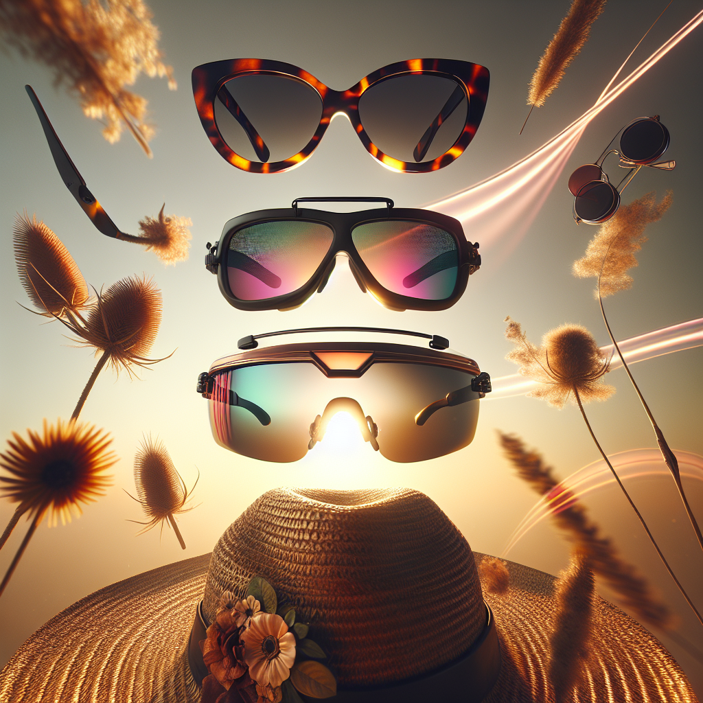

# 🕶️ Summer Sunglasses Campaign – Executive Summary

## 📊 Refined Trend Insights
Summer 2025 Sunglasses Campaign—Executive Summary

As we gear up for Summer 2025, three unmistakable style movements are shaping consumer demand. By aligning our product lineup to these trends, we’ll drive brand relevance, social buzz and incremental revenue.

1. Trend Landscape  
   • Boho-Retro Revival  
     – Think 1970s cat-eye silhouettes, warm tortoiseshells and gentle “vintage” curves—seen on Chloé and Miu Miu runways and amplified by influencers.  
   • Futuristic Sport-Shield  
     – Single-lens, wraparound designs with technical accents (grips, rubberized temples) à la Prada Active Eyewear, appealing to performance-minded shoppers.  
   • Oversized Statement  
     – Bold geometric shapes (square, aviator, wayfarer) and extra-large lenses for maximum impact and full UV coverage.

2. Strategic SKU Selection  
   • Mystique (SG003)  
     – A modern twist on 1950s glamour: an elegant cat-eye with upward-swept lenses and refined temple details.  
     – Perfect for festival-ready, bohemian-style customers.  
   • Sport (SG004)  
     – Lightweight, wraparound single-lens frame with rubber grips.  
     – Directly taps into the hyper-sporty “shield” trend and the growing athleisure market.  
   • Aviator (SG001)  
     – Oversized teardrop lenses in a slim metal frame.  
     – Bridges retro and contemporary sensibilities, offering a hero SKU that delivers both statement style and universal appeal.

3. Campaign Rationale  
   • Mystique captures the peak of summer’s boho-fest season, fueling social-media engagement and on-the-ground event sales.  
   • Sport addresses the fastest-growing segment—outdoor-adventure and fitness enthusiasts—boosting conversion among active consumers.  
   • Aviator serves as our versatile hero: its broad appeal across demographics ensures sustained promotional momentum and high-volume sell-through.

This curated trio—boho-retro, tech-sport and oversized statement—positions us for a balanced, trend-forward summer assortment that meets every consumer moment.

## 🎯 Campaign Visual

    

## ✍️ Campaign Quote
Summer Shades: Vintage Boho, Performance Sport, Timeless Aviator

## ✅ Why This Works
The phrase captures the three distinct silhouettes shown—retro cat-eye warmth, futuristic shield sportiness, and bold aviator coverage—while echoing the golden, bohemian-meets-technical summer vibe of the image and the 2025 trend pillars.

---

*Report generated on 2025-10-27*
